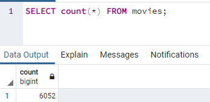
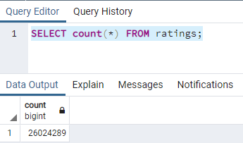

# Extract-Transform-Load: Movie Data

## Overview
The project is to create an automated pipeline that takes in new data, performs the appropriate transformations, and loads the data into existing tables. 

### Extract Step:
In the Extract step we are reading files from Wiki movies and Kaggle. The files given to us are [wikipedia-movies.json](Resources/wikipedia-movies.json), [movies_metadata.csv from Kaggle](Resources/movies_metadata.csv) and [ratings.csv from Kaggle](Resources/ratings.csv).

All these 3 files were then loaded into Pandas Dataframe for manipulation to clean data.

### Transform Step:
There were multiple iterations to clean the data extracted from 2 sources before we loaded the complete data set for further processing.

Following steps were taken to clean the wiki-movies data file:
1. Filter out TV Shows
2. Combined all the foreign language titles in one column called alt_title.
3. Changed ambiguous column names with consitent column names.
4. Added IMDB_ID column in the data frame by extracting the ID from IMDB_Link value.
5. Trimmed down the columns from the data frame by keeping only Non-Null columns.
6. Clean and format 'Box office' column
7. Clean and format 'budget' column
8. Clean and format 'release' column

Following steps were taken to clean the kaggle movies data file:
1. Keep only the rows where 'adult' column is false
2. To ensure 'video' data column contains only 'True' or 'False'
3. To ensure 'Budget', 'Id' and 'Popularity' columns are int types
4. To ensure 'release_date' is datetime type

Following steps were taken to clean ratings data from kaggle:
1. Convert the datetime to Unix time in order to get consistent format for manipulation.
2. Plot a Histogram chart on 'rating' column to visualize if provided data is reasonable.

After cleaning all data files, it was time to merge all the files into 1 data set. From looking at Kaggle movie data and wiki movie data, it looked like 6 columns were duplicate. So some more analysis was required to make a decision on each column on the source of the data.

After the analysis, following resolutions were made to merge the data files:

| Wiki                  | Kaggle               | Resolution                                     |
|-----------------------|----------------------|------------------------------------------------|
| title_wiki            | title_kaggle         | Drop Wikipedia                                 |
| running_time          | runtime              | Keep Kaggle; fill in zeros with Wikipedia data |
| budget_wiki           | budget_kaggle        | Keep Kaggle; fill in zeros with Wikipedia data |
| box_office            | revenue              | Keep Kaggle; fill in zeros with Wikipedia data |
| release_date_wiki     | release_date_kaggle  | Drop Wikipedia                                 |
| Language              | original_language    | Drop Wikipedia                                 |
| Production company(s) | production_companies | Drop Wikipedia                                 |

We also then merged movies data with rating data.

### Load Step:
In the Load step we then loaded the Movies dataframe and ratings dataframe to Postgres database table 'movies' and 'rating' respectively.

Since, the ratings data was huge, it was uploaded to database in chunks.

The load was then confirmed by quering the count on each table.

**Thus, the process of Extract, Transform and Load was completed on movies data from Kaggle and Wikis.**
